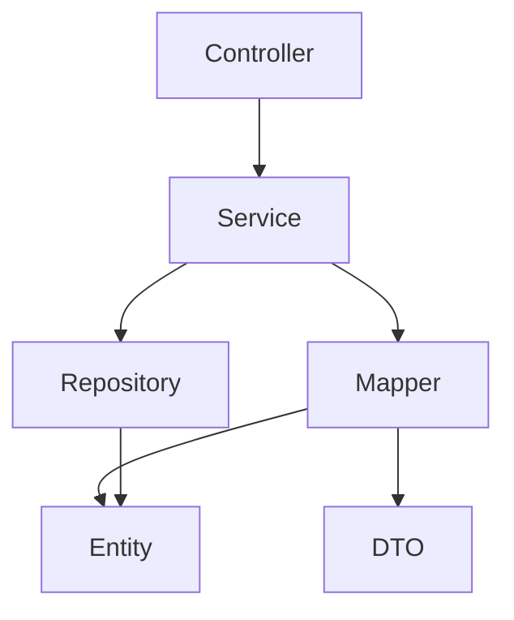

# Prime Shoes API 👟

<div align="center">

[](https://www.oracle.com/java/)
[](https://spring.io/projects/spring-boot)
[](https://maven.apache.org/)
[](LICENSE)

An elegant e-commerce API built with modern architecture and best practices.

[Getting Started](#-getting-started) •
[Architecture](#-project-architecture) •
[Documentation](#-api-documentation) •
[Contributing](#-contributing)

</div>

---

## ✨ Features

- 🛡️ **Secure Authentication** - JWT-based auth with role management
- 🛍️ **Complete E-commerce Flow** - From product browsing to order completion
- 💳 **Payment Processing** - Integrated payment system
- 🎯 **Promotion Engine** - Flexible discount and promotion system
- 📦 **Order Management** - Comprehensive order tracking
- ⭐ **Review System** - Product ratings and reviews

## 🚀 Getting Started

### Prerequisites

```bash
- Java 17+
- Maven 3.8+
- PostgreSQL
```

### Quick Start 🏃‍♂️

1️⃣ **Clone the repository**
```bash
git clone https://github.com/yourusername/prime-shoes-api.git
cd prime-shoes-api
```

2️⃣ **Configure environment**
```bash
cp .env.example .env
# Edit .env with your configurations
```

3️⃣ **Run the application**
```bash
./mvnw clean install
./mvnw spring-boot:run
```

🎉 The API will be available at `http://localhost:8080`

## 🏗️ Project Architecture

Our architecture follows clean code principles and domain-driven design practices.

### 📁 Directory Structure

```
src/main/java/br/com/primeshoes/api/
├── 📄 ApiApplication.java     # Application entry point
├── 📂 common/                # Shared components
│   ├── ⚙️ config/           # Global configurations
│   ├── ❌ exceptions/       # Exception handling
│   ├── 🔄 middleware/      # Application middleware
│   ├── 🛠️ services/        # Shared services
│   └── 🔧 utils/           # Common utilities
└── 📂 modules/              # Domain modules
    ├── 📍 address/         # Address management
    ├── 🔐 auth/            # Authentication
    ├── 🛒 cart/            # Shopping cart
    ├── 📦 order/           # Order management
    ├── 💳 payment/         # Payment processing
    ├── 👕 product/         # Product catalog
    ├── 🏷️ promotion/       # Promotion system
    ├── ⭐ review/          # Product reviews
    ├── 👥 role/            # Role management
    └── 👤 user/            # User management
```

### 🏛️ Module Architecture

Each module follows a clean, layered architecture:

<div align="center">



</div>

#### 📦 Module Structure

```
module/
├── 📄 Dto/            # Data Transfer Objects
├── 🎯 Entity/         # Domain entities
├── 🔄 Mapper/         # Object mappers
├── 💾 Repository/     # Data access
├── ⚙️ Service/        # Business logic
└── 🎮 Controller      # API endpoints
```

## 📊 System Design

### UML Class Diagram


<details>
<summary>📝 Diagram Details</summary>

- **Entities**: Core domain models with attributes
- **Relationships**: Inter-entity connections
- **Methods**: Key operations per class
- **Cardinality**: Relationship multiplicities

</details>

## 🔍 Core Modules

| Module | Description | Key Features |
|--------|-------------|--------------|
| 🔐 **Auth** | Authentication & Authorization | JWT, RBAC |
| 👤 **User** | User Management | Profiles, Addresses |
| 👕 **Product** | Product Catalog | Categories, Stock |
| 🛒 **Cart** | Shopping Cart | Items, Calculations |
| 📦 **Order** | Order Processing | Tracking, History |
| 💳 **Payment** | Payment Processing | Multiple Methods |
| 🏷️ **Promotion** | Discount System | Rules, Campaigns |

## 📚 API Documentation

Access our interactive API documentation:

```
💻 Development: http://localhost:8080/swagger-ui.html
🌐 Production: https://api.primeshoes.com/docs
```

## 🤝 Contributing

We love your input! Check out our [Contributing Guide](CONTRIBUTING.md) for ways to get started.

1. 🍴 Fork the project
2. 🌱 Create your feature branch (`git checkout -b feature/AmazingFeature`)
3. 💻 Code your changes
4. 🔄 Commit (`git commit -m 'Add AmazingFeature'`)
5. 📤 Push (`git push origin feature/AmazingFeature`)
6. 🔍 Open a Pull Request

## 📝 License

This project is under the MIT License - see the [LICENSE](LICENSE) file for details.

---

<div align="center">

Made with ❤️ by the Prime Shoes Team

</div> 