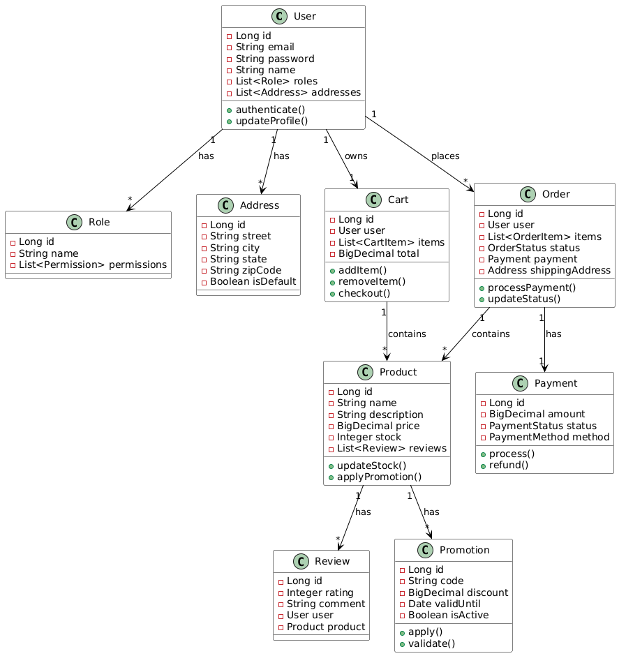

# Prime Shoes API

## 🏗️ Project Architecture

This project follows a clean, modular architecture organized by business domains.

### Directory Structure

```
src/main/java/br/com/primeshoes/api/
├── ApiApplication.java        # Application entry point
├── common/                   # Shared components
│   ├── config/              # Global configurations
│   ├── exceptions/          # Exception handling
│   ├── middleware/          # Application middleware
│   ├── services/            # Shared services
│   └── utils/               # Common utilities
└── modules/                 # Domain modules
    ├── address/             # Address management
    ├── auth/                # Authentication and authorization
    ├── cart/                # Shopping cart
    ├── order/               # Order management
    ├── payment/             # Payment processing
    ├── product/             # Product catalog
    ├── promotion/           # Promotion system
    ├── review/              # Product reviews
    ├── role/                # Role management
    └── user/                # User management
```

## 📐 Architectural Patterns

### Modular Architecture
The project is organized into independent modules, each representing a specific business domain. This approach provides:

- **Low Coupling**: Modules are independent and can be modified without affecting others
- **High Cohesion**: Related functionalities are kept together
- **Maintainability**: Facilitates code maintenance and evolution

### Module Structure
Each module follows a consistent structure with the following layers:

```
module/
├── Dto/            # Data Transfer Objects
├── Entity/         # Domain entities and data models
├── Mapper/         # DTO to Entity converters
├── Repository/     # Data access layer
├── Service/        # Business logic
└── Controller      # REST API endpoints
```

#### Layers and Responsibilities

- **Dto (Data Transfer Objects)**
  - Data transfer between layers
  - Input/Output validation
  - API documentation (Swagger/OpenAPI)

- **Entity**
  - Domain models
  - ORM mapping
  - Persistence rules

- **Mapper**
  - DTO to Entity conversion
  - Data transformation
  - Object mapping

- **Repository**
  - Data access
  - Database queries and operations
  - Entity persistence

- **Service**
  - Business rules
  - Operation orchestration
  - Use case handling

- **Controller**
  - REST endpoints
  - Request routing
  - HTTP request handling

### Common Layer
The `common` folder contains reusable components:

- **config/**: Global configurations
- **exceptions/**: Centralized exception handling
- **middleware/**: Interceptors and filters
- **services/**: Shared services
- **utils/**: Utility functions

## 📊 Architecture Diagram

### UML Class Diagram


The diagram above represents the complete system structure, showing:
- Main entities and their attributes
- Relationships between entities
- Main methods of each class
- Relationship cardinality

The source code for the diagram in PlantUML format can be found at [docs/diagrams/architecture.puml](docs/diagrams/architecture.puml).

## 🔍 System Modules

### 1. Auth and Role
- User authentication and authorization
- Role-based access control

### 2. User and Address
- User management
- Address management

### 3. Product and Review
- Product catalog
- Review system

### 4. Cart and Order
- Shopping cart
- Order management

### 5. Payment
- Payment processing

### 6. Promotion
- Promotions and discounts system

## 🚀 Getting Started

### Requirements
- Java 17+
- Maven 3.8+
- PostgreSQL

### Installation
1. Clone the repository
2. Configure the required environment variables
3. Run:
   ```bash
   ./mvnw clean install
   ./mvnw spring-boot:run
   ```

### API Documentation
Swagger UI available at:
```
http://localhost:8080/swagger-ui.html
```

## 🤝 Contributing

1. Fork the project
2. Create a branch (`git checkout -b feature/NewFeature`)
3. Commit your changes (`git commit -m 'Add NewFeature'`)
4. Push to the branch (`git push origin feature/NewFeature`)
5. Open a Pull Request

## 📝 License

This project is under the [MIT](LICENSE) license. 